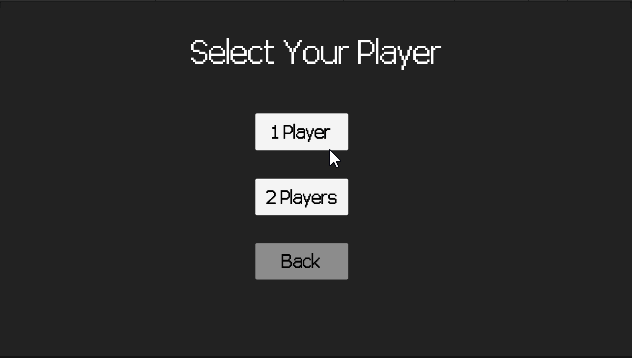
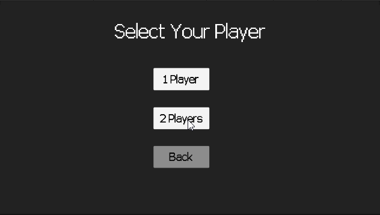

# SUPER-PONG

This is a complete Android game released in Google Play Store.  
But unfortunately, it was removed because of the title :sob:

## Description

Inspired by the 1972 Pong game, Super Pong is an upgraded version that enhances game experience by adding new game mechanics and effects.

Super Pong is a 2D sports game that simulates table tennis.  
Players control an in-game paddle by moving it vertically in the left or right part of the screen.  
The players must use the paddle to hit a ball back and forth.  

## Demo

You can play with an AI in three modes of difficulty:  
1. NOOB
2. HUMAN
3. SUPER

*There's also a 2-Player mode:*

**Google Play Store Link:**
https://play.google.com/store/apps/details?id=com.DreamJoy.Pong  
*Link not found anymore because, well, google* :cry:
